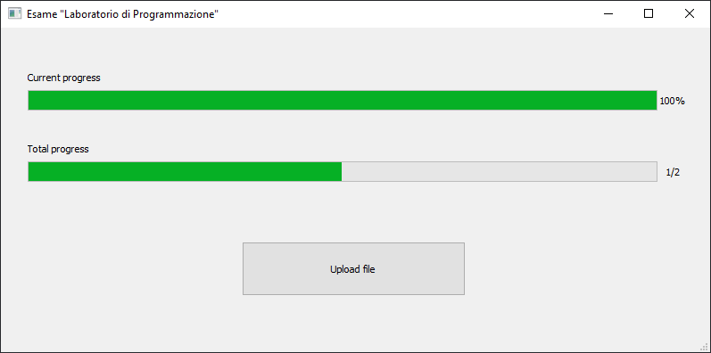

# Elaborato esame "Laboratorio di Programmazione" (B024260)
Classe che carica file di risorse e aggiorna una progress bar (usare design pattern Observer). Visualizzazione con QT.

# Example screenshot

